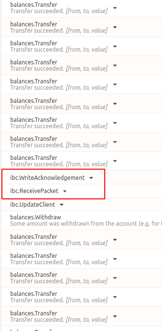

# Astar Milestone 1 Deliverables

| Number | Deliverable       | Commnets                                                |
| ------ | ----------------- | ------------------------------------------------------------ |
| 1.     | Shiden network  | https://github.com/octopus-network/Astar.git       |
| 2.     | Mock cosmos chain | https://github.com/octopus-network/mock-grandpa.git |
| 3.     | Relayer           | git clone -b dv-update-subxt https://github.com/octopus-network/ibc-rs.git |
| 4.     | Testing Script    | Plese refer to the end of this file.            |
| 5.     | Design Spec       |  [design](./design.md)                                                            |
| 6.     | Operation Guide       |  Right below                                                            |

# Operation Guide
## Launch IBC Enabled Shiden Network Locally
```bash
git clone https://github.com/octopus-network/Astar.git 
cd Astar
ls test/README.md  # <== Follow this "README.md"
```
Follow the `test/README.md` to run the IBC enabled Shiden network locally.

## Launch A Cosmos Chain with Mock Grandpa Module Locally
```bash
git clone https://github.com/octopus-network/mock-grandpa.git 
cd mock-grandpa
ls astar-readme.md  # <== Follow this "astar-readme.md"
```
Follow the `astar-readme.md` to run the Cosmos chain locally.

## Prepare the Relayer and Run E2E Test
### Requirement
* python3.8+
* `pip install toml`

### Compile the Relayer
```bash
git clone -b dv-update-subxt https://github.com/octopus-network/ibc-rs.git
cd ibc-rs
cargo build --release
```

### Run e2e Test
```bash
cd e2e-astar
python run.py -c ../hermes.toml --cmd ../target/release/hermes
ls README.md  # More details of the testing 
```
Wait until you see events of `WriteAcknowledgement` & `ReceivePacket` on the explorer of parachain like below. It takes over 10 mins.

