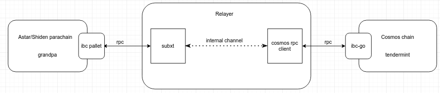
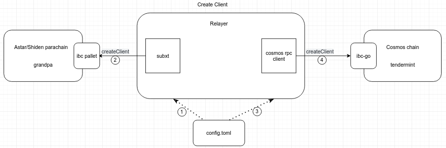
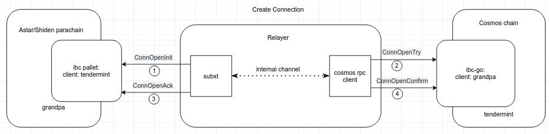
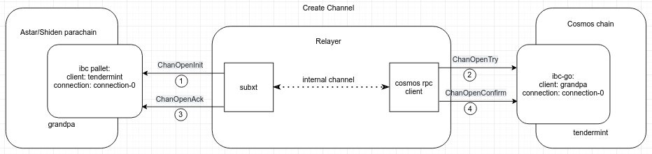
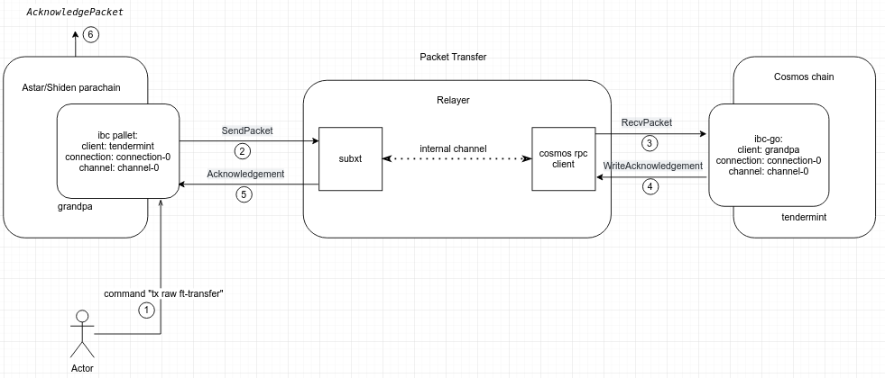

# Design of Astar/Shiden & Cosmos Bridge

This is the design spec of the Astar/Shiden & Cosmos Bridge project, which was originally proposed [here](https://forum.astar.network/t/astar-shiden-cosmos-bridge-proposal-builders-program-application/1455/11).

## Milestone 1


There are 3 major components included in the bridge: Astar/Shiden parachain(PC), relayer, and Cosmso chain(CC). To transfer [ICS04 packets](https://github.com/cosmos/ibc/blob/7046202b645c65b1a2b7f293312bca5d651a13a4/spec/core/ics-004-channel-and-packet-semantics/README.md?_pjax=%23js-repo-pjax-container%2C%20div%5Bitemtype%3D%22http%3A%2F%2Fschema.org%2FSoftwareSourceCode%22%5D%20main%2C%20%5Bdata-pjax-container%5D#packet-flow--handling) from one chain to the other, the bridge must arm with the following functionalities:

* Astar/Shiden parachain(PC): The PC must be integrated with pallet [ibc](https://github.com/octopus-network/substrate-ibc), which must implement the standards of [ICS02](https://github.com/cosmos/ibc/blob/7046202b645c65b1a2b7f293312bca5d651a13a4/spec/core/ics-002-client-semantics/README.md?_pjax=%23js-repo-pjax-container%2C%20div%5Bitemtype%3D%22http%3A%2F%2Fschema.org%2FSoftwareSourceCode%22%5D%20main%2C%20%5Bdata-pjax-container%5D), [ICS03](https://github.com/cosmos/ibc/blob/7046202b645c65b1a2b7f293312bca5d651a13a4/spec/core/ics-003-connection-semantics/README.md?_pjax=%23js-repo-pjax-container%2C%20div%5Bitemtype%3D%22http%3A%2F%2Fschema.org%2FSoftwareSourceCode%22%5D%20main%2C%20%5Bdata-pjax-container%5D), and [ICS04](https://github.com/cosmos/ibc/blob/7046202b645c65b1a2b7f293312bca5d651a13a4/spec/core/ics-004-channel-and-packet-semantics/README.md?_pjax=%23js-repo-pjax-container%2C%20div%5Bitemtype%3D%22http%3A%2F%2Fschema.org%2FSoftwareSourceCode%22%5D%20main%2C%20%5Bdata-pjax-container%5D). 

* Relayer: The relayer must support heterogeneous blockchains, which are of type Substrate and Cosmos SDK for now. The [Hermes relayer](https://hermes.informal.systems/) officially supports relaying for the [IBC protocol](https://github.com/cosmos/ibc) between Cosmos SDK chains. In this project, the relayer realizes Substrate chains support based on Hermes.

* Cosmso chain(CC): To respond to messages from Substrate chains, the Cosmos chain must be able to verify Grandpa consensus. A mock Grandpa light client module is implemented on the Cosmos chain to handle the messages from Substrate chains.

### [Ibc Pallet](https://github.com/octopus-network/substrate-ibc)
The ibc pallet is integrated with the [modules in ibc-rs](https://github.com/octopus-network/ibc-rs/tree/b98094a57620d0b3d9f8d2caced09abfc14ab00f/modules), which implements the [ibc spec](https://github.com/cosmos/ibc/tree/7046202b645c65b1a2b7f293312bca5d651a13a4/spec) and leave the chain specific logics, which are named `???Readers` and `???Keepers`, to the ibc pallet.  

List of `???Readers` and `???Keepers`:
* [ClientReader](https://github.com/octopus-network/ibc-rs/blob/b98094a57620d0b3d9f8d2caced09abfc14ab00f/modules/src/ics02_client/context.rs?_pjax=%23js-repo-pjax-container%2C%20div%5Bitemtype%3D%22http%3A%2F%2Fschema.org%2FSoftwareSourceCode%22%5D%20main%2C%20%5Bdata-pjax-container%5D#L14) & [ClientKeeper](https://github.com/octopus-network/ibc-rs/blob/b98094a57620d0b3d9f8d2caced09abfc14ab00f/modules/src/ics02_client/context.rs?_pjax=%23js-repo-pjax-container%2C%20div%5Bitemtype%3D%22http%3A%2F%2Fschema.org%2FSoftwareSourceCode%22%5D%20main%2C%20%5Bdata-pjax-container%5D#L29)
* [ConnectionReader](https://github.com/octopus-network/ibc-rs/blob/b98094a57620d0b3d9f8d2caced09abfc14ab00f/modules/src/ics03_connection/context.rs?_pjax=%23js-repo-pjax-container%2C%20div%5Bitemtype%3D%22http%3A%2F%2Fschema.org%2FSoftwareSourceCode%22%5D%20main%2C%20%5Bdata-pjax-container%5D#L17) & [ConnectionKeeper](https://github.com/octopus-network/ibc-rs/blob/b98094a57620d0b3d9f8d2caced09abfc14ab00f/modules/src/ics03_connection/context.rs?_pjax=%23js-repo-pjax-container%2C%20div%5Bitemtype%3D%22http%3A%2F%2Fschema.org%2FSoftwareSourceCode%22%5D%20main%2C%20%5Bdata-pjax-container%5D#L67)
* [ChannelReader](https://github.com/octopus-network/ibc-rs/blob/b98094a57620d0b3d9f8d2caced09abfc14ab00f/modules/src/ics04_channel/context.rs?_pjax=%23js-repo-pjax-container%2C%20div%5Bitemtype%3D%22http%3A%2F%2Fschema.org%2FSoftwareSourceCode%22%5D%20main%2C%20%5Bdata-pjax-container%5D#L20) & [ChannelKeeper](https://github.com/octopus-network/ibc-rs/blob/b98094a57620d0b3d9f8d2caced09abfc14ab00f/modules/src/ics04_channel/context.rs?_pjax=%23js-repo-pjax-container%2C%20div%5Bitemtype%3D%22http%3A%2F%2Fschema.org%2FSoftwareSourceCode%22%5D%20main%2C%20%5Bdata-pjax-container%5D#L82)

#### Example Flow of ibc-rs Invocation
* An update client transaction is submitted to ibc pallet's [deliver function](https://github.com/octopus-network/substrate-ibc/blob/ba770848ff400ecd42b5f4309db889a99517c69d/src/lib.rs?_pjax=%23js-repo-pjax-container%2C%20div%5Bitemtype%3D%22http%3A%2F%2Fschema.org%2FSoftwareSourceCode%22%5D%20main%2C%20%5Bdata-pjax-container%5D#L887), which is the only dispatchable function in ibc pallet so far.
* The transaction is [passed to the ibc-rs' routing module](https://github.com/octopus-network/substrate-ibc/blob/ba770848ff400ecd42b5f4309db889a99517c69d/src/lib.rs?_pjax=%23js-repo-pjax-container%2C%20div%5Bitemtype%3D%22http%3A%2F%2Fschema.org%2FSoftwareSourceCode%22%5D%20main%2C%20%5Bdata-pjax-container%5D#L899).
* When processing the transaction, ibc-rs call a client reader interface to [query the client state](https://github.com/octopus-network/ibc-rs/blob/b98094a57620d0b3d9f8d2caced09abfc14ab00f/modules/src/ics02_client/handler/update_client.rs?_pjax=%23js-repo-pjax-container%2C%20div%5Bitemtype%3D%22http%3A%2F%2Fschema.org%2FSoftwareSourceCode%22%5D%20main%2C%20%5Bdata-pjax-container%5D#L45), which is [implemented in ibc pallet](https://github.com/octopus-network/substrate-ibc/blob/ba770848ff400ecd42b5f4309db889a99517c69d/src/client.rs?_pjax=%23js-repo-pjax-container%2C%20div%5Bitemtype%3D%22http%3A%2F%2Fschema.org%2FSoftwareSourceCode%22%5D%20main%2C%20%5Bdata-pjax-container%5D#L19).    


### IBC Communication Process
The process can be separated to 2 parts generally:
* Establish ICS02 client, ICS03 connection, and ICS04 channel to link PC & CC.
* Transfer ICS04 packets between PC & CC based on the establishments above.

### Establish ICS02 Client, ICS03 Connection, and ICS04 Channel
* During the establishments, the relayer is used as a CLI tool by users to start the establishments in sequence(client -> connection -> channel).
* The configurations of PC & CC are store in `config.toml`, including chain id `id`, websocket address `websocket_addr`, and chain type `account_prefix`.
* All the examples below assume the relayer initiates the establishment by sending requests to PC first; Initiations from CC also work.  

#### Flow of ICS02 Client Establishment

1. The relayer retrieves the configurations of CC from `config.toml`.
2. The relayer sends a `createClient` request, including the configurations of CC, to PC to create an IBC client of CC(client: tendermint).
3. The relayer retrieves the configurations of PC from `config.toml`.
4. The relayer sends a`createClient` request, including the configurations of PC, to CC to create an IBC client of PC(client: grandpa).

If both `createClient` requests succeed, the clients are created.

##### Key Modifications in Relayer
* Add a client type: Grandpa
```rust
    pub fn prefix(client_type: ClientType) -> &'static str {
        match client_type {
            ClientType::Tendermint => ClientType::Tendermint.as_str(),
            ClientType::Grandpa => ClientType::Grandpa.as_str(),
// --snip--
        }
    }
```

* Spawn chain runtime for Substrate type chain
```rust
    let handle = match account_prefix.as_str()  {
        "cosmos" => {
// --snip--
        },
        "substrate" => {
            let rt = Arc::new(TokioRuntime::new().unwrap());
            let handle = ChainRuntime::<SubstrateChain>::spawn(chain_config, rt).map_err(SpawnError::relayer)?;
            handle
        }
    };
```

* Add Grandpa consensus type
```rust
pub enum AnyConsensusState {
    Tendermint(consensus_state::ConsensusState),
    Grandpa(ics10_grandpa::consensus_state::ConsensusState),
// --snip--
}
```

* Implement monitor for events from Substrate chain
```rust
    fn init_event_monitor(
        &self,
        rt: Arc<TokioRuntime>,
    ) -> Result<(EventReceiver, TxMonitorCmd), Error> {
        tracing::info!("in Substrate: [init_event_mointor]");

        tracing::info!(
            "In Substrate: [init_event_mointor] >> websocket addr: {:?}",
            self.config.websocket_addr.clone()
        );
// --snip--
        thread::spawn(move || event_monitor.run());
    }
```

* Implement transaction interface to submit transactions to Substrate chains
```rust
    fn send_messages_and_wait_commit(
        &mut self,
        proto_msgs: Vec<Any>,
    ) -> Result<Vec<IbcEvent>, Error> {
// --snip--
        let client = async {
            let client = ClientBuilder::new()
                .set_url(&self.websocket_url.clone())
                .build::<ibc_node::DefaultConfig>().await.unwrap();
            sleep(Duration::from_secs(4)).await;
            let result = self.deliever(proto_msgs, client).await.unwrap();
            result
        };
        let _ = self.block_on(client);
// --snip--
    }
```
* Implement client query of Substrate chains
```rust
    fn query_client_state(
        &self,
        client_id: &ClientId,
        height: ICSHeight,
    ) -> Result<Self::ClientState, Error> {
// --snip--
        let client_state = async {
            let client = ClientBuilder::new()
                .set_url(&self.websocket_url.clone())
                .build::<ibc_node::DefaultConfig>().await.unwrap();
// --snip--
    }
```

#### Flow of ICS03 Connection Establishment


Based on the existing clients created above, the relayer starts the handshakes of establishing connections.
1. The relayer sends a `ConnOpenInit` request, including the configurations of CC, to PC.
2. Upon an event emitted responding to the `ConnOpenInit` request, the relayer sends a`ConnOpenTry` request, including the configurations of PC, to CC.
3. Upon an event emitted responding to the `ConnOpenTry` request, the relayer sends a`ConnOpenAck` request, including the configurations of CC, to PC.
4. Upon an event emitted responding to the `ConnOpenAck` request, the relayer sends a`ConnOpenConfirm` request, including the configurations of PC, to CC.
5. Upon an event emitted responding to the `ConnOpenConfirm` request, the connections linking PC & CC are created.

##### Key Modifications in Relayer
* Implement connection query of Substrate chains
```rust
    fn query_connection(
        &self,
        connection_id: &ConnectionId,
        height: ICSHeight,
    ) -> Result<ConnectionEnd, Error> {
// --snip--
        let connection_end = async {
            let client = ClientBuilder::new()
                .set_url(&self.websocket_url.clone())
                .build::<ibc_node::DefaultConfig>().await.unwrap();
// --snip--
    }
```

#### Flow of ICS04 Channel Establishment


Based on the existing clients and connections created above, the relayer starts the handshakes to establish channels.
1. The relayer sends a `ChanOpenInit` request, including the configurations of CC, to PC.
2. Upon an event emitted responding to the `ChanOpenInit` request, the relayer sends a`ChanOpenTry` request, including the configurations of PC, to CC.
3. Upon an event emitted responding to the `ChanOpenTry` request, the relayer sends a`ChanOpenAck` request, including the configurations of CC, to PC.
4. Upon an event emitted responding to the `ChanOpenAck` request, the relayer sends a`ChanOpenConfirm` request, including the configurations of PC, to CC.
5. Upon an event emitted responding to the `ChanOpenConfirm` request, the connections linking PC & CC are created.

##### Key Modifications in Relayer
* Implement the channel query of Substrate chains
```rust
    fn query_channel(
        &self,
        port_id: &PortId,
        channel_id: &ChannelId,
        height: ICSHeight,
    ) -> Result<ChannelEnd, Error> {
// --snip--
        let channel_end = async {
            let client = ClientBuilder::new()
                .set_url(&self.websocket_url.clone())
                .build::<ibc_node::DefaultConfig>().await.unwrap();
// --snip--
    }
```

### Transfer ICS04 Packets
* The examples below assums the actor submits a transaction request to PC to trigger the cross-chain transfer; A transaction request CC also works. 
#### Flow of ICS04 Packet Transfer


Based on the existing clients, connections, and channels created above, the bridge is able to transfer cross-chain packets.
1. An actor submits a transaction to PC by a Hermes command `tx raw ft-transfer`.
2. The IBC pallet in the PC emits an event `SendPacket`.
3. The relayer detects the event `SendPacket`, then submits a `RecvPacket` transaction to the CC.
4. The CC handles the `RecvPacket` transaction request and emits an event `WriteAcknowledgement`.
5. The relayer detects the event `WriteAcknowledgement`, then submits an `Acknowledgement` transaction to the CC.
6. The IBC pallet in the PC handles the `Acknowledgement` transaction request, then emits an event `AcknowledgePacket`.

##### Key Modifications in Relayer
* Implement the packet query of Substrate chains
```rust
    fn query_packet_commitments(
        &self,
        request: QueryPacketCommitmentsRequest,
    ) -> Result<(Vec<PacketState>, ICSHeight), Error> {
// --snip--
        let packet_commitments = async {
            let client = ClientBuilder::new()
                .set_url(&self.websocket_url.clone())
                .build::<ibc_node::DefaultConfig>().await.unwrap();
// --snip--
    }
```